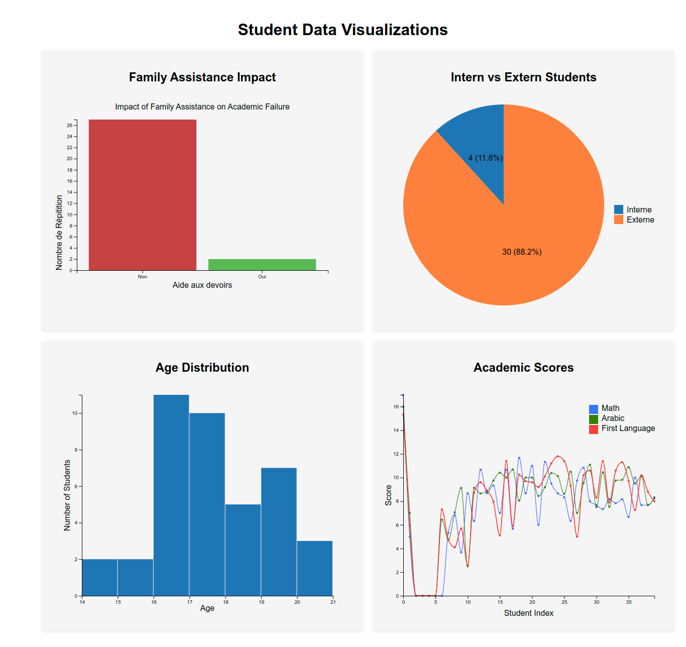

## Overview
This project focuses on exploring and visualizing a dataset containing personal details, academic performance, and demographic information of students. The goal is to create insightful visualizations that can help understand the student population and inform educational decisions.

## Key Visualizations
The following key visualizations are created from the dataset:

1. **Age Distribution**: A histogram or bar chart visualizing the age distribution of students to identify trends within the student population.
2. **Academic Performance**: A line chart displaying various academic performance metrics, helping to identify strengths and weaknesses in different subjects.
3. **Demographic Composition**: A pie chart illustrating the composition of students as interns or externs.
4. **Family Assistance Impact**: A bar chart visualizing the relationship between family assistance and academic performance.

## Color Scheme
The visualizations utilize a professional color scheme consisting of blues, greens, and oranges to ensure clarity and readability.

## Insights Extraction
The visualizations aim to extract the following insights:
- Understanding age distribution and identifying trends or outliers.
- Analyzing academic performance across subjects.
- Exploring demographic composition and identifying diversity within the student body.
- Investigating the relationship between family assistance and academic performance.

## Data Preparation
Data preparation involved:
- Removing null values for data integrity.
- Standardizing text for consistency.
- Translating Arabic entries into French.
- Trimming column names for compatibility.
- Converting cleaned data from Excel format to CSV for visualization.

## Interactive Data Visualization with D3.js
The project utilizes D3.js for creating interactive visualizations. The JavaScript code is structured into distinct functions, each serving a specific purpose in data manipulation and rendering.

## Deployment
The visualizations will be deployed to ObservableHQ, allowing for interactive sharing and exploration of the data.

## Conclusion
This project provides valuable insights for school administration, educators, and policymakers to improve educational outcomes based on data-driven decisions.